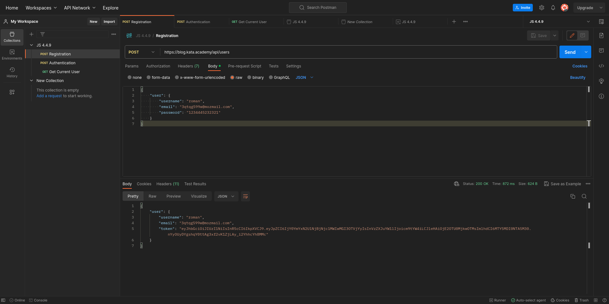
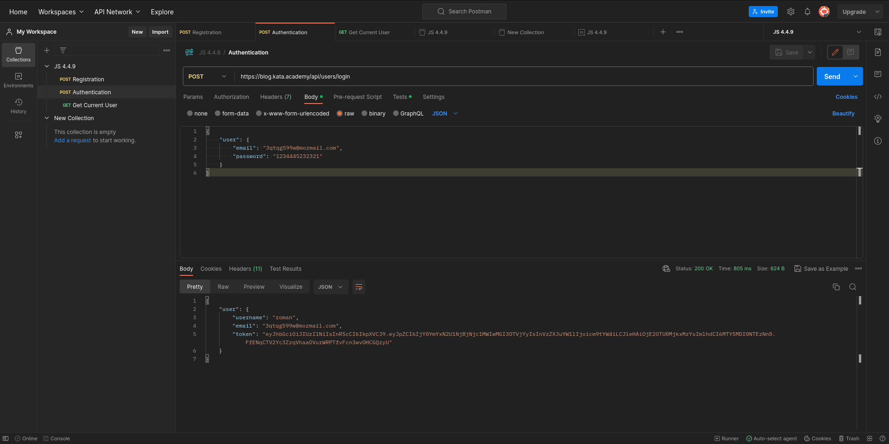
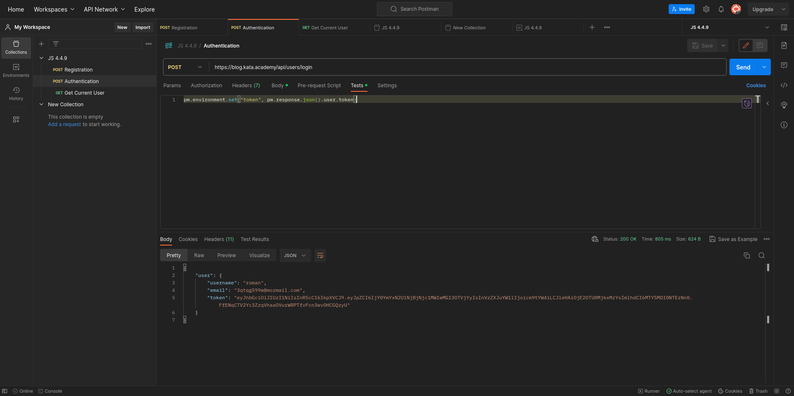

# JS4.4.9
<figure>
  
  <figcaption>Registration</figcaption>
</figure>

<figure>
  
   <figcaption>Authentication</figcaption>
</figure>

<figure>
  
   <figcaption>add token img environment variables.</figcaption>
</figure>

<figure>
  
   <figcaption>get data for current user</figcaption>
</figure>

